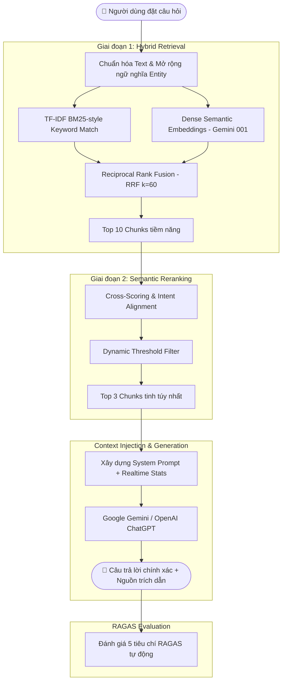

# 🏨 Grand Palace PMS — Hệ Thống Quản Lý Khách Sạn & Trợ Lý Ảo AI Tích Hợp RAG

<div align="center">


*Hệ thống quản lý khách sạn hiện đại (Property Management System) tích hợp Trợ lý Ảo AI đàm thoại với công nghệ **Hybrid RAG 2-Stage**, cơ chế chống ảo giác (Anti-Hallucination) và hệ thống đánh giá **RAGAS 5 tiêu chí** theo chuẩn quốc tế.*

</div>

---

## 📑 Mục Lục
- [🌟 Điểm Nổi Bật](#-điểm-nổi-bật)
- [🏗️ Kiến Trúc Hệ Thống & RAG Engine](#️-kiến-trúc-hệ-thống--rag-engine)
- [📊 Bộ Tiêu Chí Đánh Giá RAGAS](#-bộ-tiêu-chí-đánh-giá-ragas)
- [🛠️ Công Nghệ Sử Dụng](#️-công-nghệ-sử-dụng)
- [📁 Cấu Trúc Thư Mục](#-cấu-trúc-thư-mục)
- [🚀 Hướng Dẫn Cài Đặt & Chạy Dự Án](#-hướng-dẫn-cài-đặt--chạy-dự-án)
- [🔑 Tài Khoản Trải Nghiệm Demo](#-tài-khoản-trải-nghiệm-demo)
- [🧠 Quản Lý Tri Thức & Tái Tạo Vector Embeddings](#-quản-lý-tri-thức--tái-tạo-vector-embeddings)

---

## 🌟 Điểm Nổi Bật

### 1. 🏢 Quản Lý Vận Hành Khách Sạn (PMS Core)
- **Lưới phòng 3D Flip-In theo tầng:** Hiển thị trực quan 20 phòng thuộc 4 phân loại thực tế:
  - 🛏️ **Phòng Đơn:** 6 phòng (101 - 104, 802, 901), giá từ 600.000đ/đêm.
  - 👫 **Phòng Đôi:** 6 phòng (201 - 204, 304, 804), giá từ 900.000đ/đêm.
  - 👑 **VIP / President:** 5 phòng (301 - 303, 403, 803), giá từ 1.500.000đ/đêm.
  - 🌆 **Suite Ban Công:** 3 phòng (401, 402, 801), giá từ 1.400.000đ/đêm.
- **Trạng thái phòng & Housekeeping:** Theo dõi thời gian thực (Trống, Đang ở, Dọn dẹp, Bảo trì) kết hợp quy trình buồng phòng (✨ Sạch, 🧹 Bẩn, 🧼 Đang dọn).
- **Quản lý Đặt phòng (Bookings):** Quy trình Check-in, Check-out, tính phụ phí tự động, đồng bộ dữ liệu Realtime qua **Server-Sent Events (SSE)**.
- **Quản lý Khách hàng & Thành viên:** Phân hạng tự động (Mới, Bạc 🥈, Vàng 🥇, Kim Cương 💎) theo chi tiêu tích lũy.
- **20 Chương trình Ưu đãi & Voucher thông minh:** Giảm % theo loại phòng, Voucher tiền mặt, Combo tuần trăng mật, Flash deal đêm muộn.
- **Dashboard & Báo cáo Doanh thu:** Biểu đồ tương tác (Recharts) thống kê doanh thu theo ngày/tháng, tỷ lệ lấp đầy phòng.
- **Tiện ích giá trị gia tăng:** Đặt xe Taxi công nghệ đón trả, Widget thời tiết Hà Nội/Thái Nguyên thời gian thực, Dịch đa ngôn ngữ.

---

### 2. 🤖 Trợ Lý Ảo AI Tích Hợp Hybrid RAG 2-Stage
- **Không chỉ trả lời chung chung:** Trợ lý ảo AI nắm rõ toàn bộ 89 tài liệu tri thức nội bộ của khách sạn (chính sách nhận/trả phòng, đổi hủy phòng, quy định thú cưng/hút thuốc, giá phòng, tiện ích spa/gym/hồ bơi).
- **Real-time Context Grounding:** Tự động nạp số lượng phòng trống, khách đang ở, doanh thu hôm nay vào System Prompt để trả lời chính xác số liệu vận hành thực tế.
- **Chống ảo giác (Anti-Hallucination):** Nguyên tắc *answerable: false* nghiêm ngặt — nếu tài liệu nội bộ không có, AI sẽ thành thật thông báo chưa tìm thấy thông tin thay vì tự bịa đặt.
- **So sánh song song 2 Model:** Đối chiếu câu trả lời cùng lúc giữa **Google Gemini** và **OpenAI ChatGPT** trên cùng một ngữ cảnh.

---

## 🏗️ Kiến Trúc Hệ Thống & RAG Engine

Hệ thống RAG được thiết kế theo chuẩn công nghiệp 2 giai đoạn (2-Stage Pipeline):



---

## 📊 Bộ Tiêu Chí Đánh Giá RAGAS

Hệ thống tự động chấm điểm chất lượng câu trả lời theo 5 tiêu chuẩn vàng của framework **RAGAS**:

| Tiêu Chí | Thang Điểm | Ý Nghĩa |
| :--- | :---: | :--- |
| **Faithfulness** | 0.0 – 1.0 | **Độ trung thực:** Câu trả lời có bám sát 100% tài liệu trích xuất hay bịa đặt (hallucination). |
| **Answer Relevance** | 0.0 – 1.0 | **Độ liên quan:** Câu trả lời có đi đúng trọng tâm câu hỏi của khách hàng hay lan man. |
| **Context Recall** | 0.0 – 1.0 | **Độ thu hồi ngữ cảnh:** Tài liệu RAG trích xuất có bao phủ đủ các thông tin cần thiết. |
| **Context Precision** | 0.0 – 1.0 | **Độ chuẩn xác ngữ cảnh:** Thứ hạng của tài liệu liên quan nhất có nằm ở vị trí đầu tiên. |
| **Semantic Correctness** | 0.0 – 1.0 | **Chuẩn xác ngữ nghĩa:** Đánh giá mức độ đồng điệu về logic và ngữ nghĩa tổng thể. |

---

## 🛠️ Công Nghệ Sử Dụng

### Frontend
- **Framework:** [React 19](https://react.dev/) + [Vite](https://vitejs.dev/)
- **Data Visualization:** [Recharts](https://recharts.org/)
- **Styling:** Vanilla CSS Modern Glassmorphism, Micro-animations, CSS Variables Dark/Light mode
- **Realtime:** Server-Sent Events (SSE) Listener

### Backend
- **Runtime:** [Node.js](https://nodejs.org/) + [Express](https://expressjs.com/)
- **ORM & Database:** [Sequelize](https://sequelize.org/) + [MySQL 8.0](https://www.mysql.com/)
- **Bảo mật & Auth:** JSON Web Token (JWT), bcryptjs, Helmet, CORS
- **AI & Embedding:** `@google/generative-ai` (`gemini-embedding-001`, `gemini-2.5-flash`), `openai` (`gpt-4o-mini`)
- **RAG Engine:** In-memory TF-IDF + Cosine Similarity Vector Search thuần Node.js (tốc độ < 15ms)

---

## 📁 Cấu Trúc Thư Mục

```text
QlyKhachSan/
├── backend/
│   ├── src/
│   │   ├── config/             # Cấu hình kết nối MySQL (Sequelize)
│   │   ├── data/
│   │   │   ├── knowledgeBase.json      # 89 Chunks dữ liệu nội bộ khách sạn
│   │   │   └── knowledgeEmbeddings.json# Dense Vector Embeddings (3072 chiều)
│   │   ├── evaluation/         # Bộ công cụ Benchmark RAGAS & Test Dataset 100 mẫu
│   │   ├── middlewares/        # Auth JWT & Xử lý lỗi tập trung
│   │   ├── models/             # Sequelize models: User, Phong, DatPhong, KhachHang
│   │   ├── routes/             # API routes: /phong, /dat-phong, /ai-chat, /auth...
│   │   ├── services/
│   │   │   ├── ragService.js       # Bộ điều phối RAG chính
│   │   │   ├── retrievalService.js # Stage 1: Hybrid Retrieval & RRF
│   │   │   ├── rerankerService.js  # Stage 2: Reranking & Dynamic Threshold
│   │   │   ├── embeddingService.js # Kết nối Gemini Embedding API
│   │   │   └── troLyAiService.js   # LLM Generation & Chấm điểm RAGAS
│   │   └── server.js           # Entrypoint Express server
│   ├── regen_embeddings.js     # Script tái sinh toàn bộ vector embeddings
│   └── package.json
│
├── frontend/
│   ├── src/
│   │   ├── components/
│   │   │   ├── TroLyAIGocPhai.jsx  # Chatbot AI Popup góc phải tích hợp RAGAS
│   │   │   ├── TaxiPage.jsx        # Trang gọi xe đưa đón
│   │   │   └── WeatherWidget.jsx   # Widget thời tiết thời gian thực
│   │   ├── main.jsx            # Ứng dụng chính PMS & Quản lý phòng
│   │   └── styles.css          # Hệ thống Design Tokens & Giao diện hiện đại
│   └── package.json
│
├── .gitignore
└── README.md
```

---

## 🚀 Hướng Dẫn Cài Đặt & Chạy Dự Án

### 1. Yêu cầu hệ thống
- **Node.js** >= 18.x
- **MySQL** >= 8.0 (hoặc MariaDB)
- **Git**

### 2. Cấu hình Cơ sở dữ liệu & Biến môi trường
1. Tạo database trong MySQL:
```sql
CREATE DATABASE hotel_management CHARACTER SET utf8mb4 COLLATE utf8mb4_unicode_ci;
```

2. Cấu hình file `backend/.env` (tham khảo `backend/.env.example`):
```env
DB_HOST=localhost
DB_PORT=3306
DB_USER=root
DB_PASS=mật_khẩu_mysql_của_bạn
DB_NAME=hotel_management

JWT_SECRET="YourSecretKey"
JWT_EXPIRES_IN=8h

# Khóa API Google Gemini (Lấy miễn phí tại: https://aistudio.google.com/)
GEMINI_API_KEY=your_gemini_api_key_here
GEMINI_MODEL=gemini-2.5-flash

# Tùy chọn: Khóa OpenAI nếu muốn so sánh với ChatGPT
OPENAI_API_KEY=your_openai_api_key_here
OPENAI_MODEL=gpt-4o-mini
```

### 3. Cài đặt Dependencies & Khởi chạy Backend
```bash
cd backend
npm install
npm run dev
```
> Backend sẽ khởi chạy tại: `http://localhost:5001`. Cơ sở dữ liệu và tài khoản mẫu sẽ được tự động khởi tạo khi khởi động.

### 4. Cài đặt Dependencies & Khởi chạy Frontend
Mở một terminal mới:
```bash
cd frontend
npm install
npm run dev
```
> Truy cập giao diện ứng dụng tại: `http://localhost:5173`.

---

## 🔑 Tài Khoản Trải Nghiệm Demo

Hệ thống đã chuẩn bị sẵn 2 tài khoản mặc định phục vụ chạy thử nghiệm:

| Vai Trò | Tên Đăng Nhập | Mật Khẩu | Quyền Hạn |
| :--- | :--- | :--- | :--- |
| **Quản trị viên (Admin)** | `admin` | `admin123` | Toàn quyền: Thêm/Sửa/Xóa phòng, quản lý doanh thu, xem báo cáo, cấu hình AI |
| **Nhân viên lễ tân (Staff)** | `staff` | `staff123` | Check-in, Check-out, cập nhật dọn buồng phòng, tra cứu thông tin khách |

---

## 🧠 Quản Lý Tri Thức & Tái Tạo Vector Embeddings

Nếu bạn thêm mới hoặc chỉnh sửa nội dung tài liệu trong file [`backend/src/data/knowledgeBase.json`](file:///c:/Users/Ngoc/Downloads/QlyKHachSan-20260616T040536Z-3-001/QlyKHachSan/backend/src/data/knowledgeBase.json), hãy chạy lệnh sau để tái sinh các vector embeddings:

```bash
cd backend
node regen_embeddings.js
```

Script sẽ tự động kết nối API Gemini Batch Embedding, nạp toàn bộ vector vào `knowledgeEmbeddings.json` và cập nhật tức thì vào RAM server.

---

<div align="center">

Dự án được xây dựng & tối ưu hóa bởi [ngoc-oss](https://github.com/ngoc-oss).

⭐ **Hãy để lại 1 Star nếu dự án hữu ích đối với bạn!**

</div>
